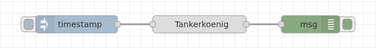
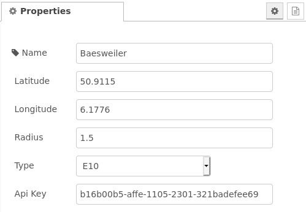
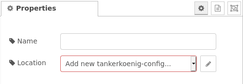
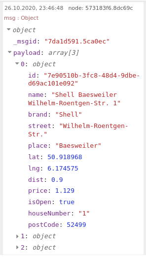
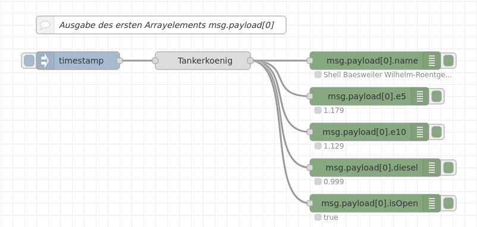

# node-red-contrib-tankerkoenig
Node-RED node to receive actual petrol prices (Tankerkoenig.de/Tankerkönig api).

**Remark:** Only valid for filling stations in Germany.

Node-RED Knoten zum Abruf der Kraftstoffpreise (Tankerkoenig.de/Tankerkönig api) für Tankstellen in Deutschland.  
Es werden die Preise E5, E10 und Diesel in einem Umkreis zum gewählten Zielort ermittelt und ausgegeben.

**Hinweis:** Es ist eine vorherige Registrierung bei tankerkoenig.de notwendig, um einen persönlichen API-Key für den Zugriff auf die Preisinformationen zu erhalten.

  
**Fig. 1:** Node-Darstellung

## Installation

### In Node-RED (bevorzugt)
* Via Manage Palette -> Suche nach "node-red-contrib-tankerkoenig"

### In einer Shell
* Wechsel in das Node-RED Installationsverzeichnis, z.B.: `~/.node-red`
* Ausführen von `npm install node-red-contrib-tankerkoenig`

## Verwendung
Der Node kann sehr einfach angewandt werden:

**Fig. 2:** Grundsätzliche Verwendung des Nodes

Im Beispiel wird der Node manuell getriggert, die Kraftstoff-Preisinformationen sind am Node-Ausgang verfügbar.

### Configuration Node
Vor der Verwendung des Nodes ist ein ***tankerkoenig-config*** Node anzulegen. Dies wird über die Auswahl *Add new tankerkoenig-config..* in der Node-Konfiguration initiiert.

#### API-Key
Zum Datenabruf wird ein sog. ***API-Key*** benötigt. Dieser ist ein individueller, persönlicher Key und kann auf der Seite <https://creativecommons.tankerkoenig.de/> beantragt werden.

Der generierte API-Key ist im Configuration Node *tankerkoenig-config* im Feld ***Api Key*** einzugeben.  

**Fig. 3:** Configuration Node

#### Latitude, Longitude
Der Configuration Node ist für jede Position notwendig, für dessen Umkreis eine Preissuche erfolgen soll. Die Koordinaten dieser Suchposition sind dabei in ***Latitude*** und ***Longitude*** einzugeben.  

#### Radius
In der Eingabe ***Radius*** wird der Suchradius um die Suchposition in Kilometern eingeben (Umkreissuche). Je größer dieser Wert, umso mehr Tankstellen werden gefunden.  

#### Type
In dem Pulldown-Feld ***Type*** werden die Kraftstoffsorten ausgewählt, deren Preisinformationen am Node-Ausgang ausgegeben werden sollen. Mögliche Auswahlen sind:
- E5
- E10
- Diesel
- All: Alle drei Kraftstoffsorten

### Node Konfiguration
Die Konfiguration des Nodes selber ist sehr einfach: Neben der Auswahl des *Configuration Nodes* im Feld ***Location*** kann optional noch ein Name eingeben werden.

**Fig. 4:** Node Eigenschaften

### Eingang
Der Node wird durch eine `msg` mit beliebigem Inhalt getriggert.  
Weitere Eingangsdaten wertet der Node nicht aus.

### Ausgänge
Der Node gibt die gelesenen Kraftstoffdaten über `msg.payload` aus.

**Fig. 5:** Node Ausgangsdaten

Für jede in der Umkreissuche gefundene Tankstelle wird ein Arrayelement innerhalb `msg.payload` mit folgenden Attributen angelegt:
- `msg.payload[].name`, `msg.payload[].brand`: Gibt den **Namen** und die **Gesellschaft** der Tankstelle an.
- `msg.payload[].postCode`, `msg.payload[].place`, `msg.payload[].street`, `msg.payload[].houseNumber`: **Adresse** der Tankstelle.
- `msg.payload[].lat`, `msg.payload[].lng`, `msg.payload[].dist`: Gibt die **Position** der Tankstelle und deren **Entfernung zur Suchposition** (Positionsangabe aus dem Config Node) an.
- `msg.payload[].isOpen`: Gibt an, ob die Tankstelle zum aktuellen Zeitpunkt **geöffnet** hat.  
  (*true*: geöffnet, *false*: geschlossen)
- `msg.payload[].price`: Preisangabe in EURO, sofern genau eine Kraftstoffsort ausgewählt wurde.  
   Im Falle, dass als Kraftstoffsorte *ALL* im Configuration Node angegeben wurde, werden anstatt `msg.payload[].price` die drei Ausgangsdaten `msg.payload[].e5`, `msg.payload[].e10` und `msg.payload[].diesel` ausgegeben.

## Beispiel
***
**Hinweis**: Beispiel-Flows sind im Unterverzeichnis <examples\> abgelegt.  
In Node-RED können sie mittels der Importfunktion mit Auswahl von *Examples* im vertikalen Tab-Menü automatisch importiert werden.
***

Der Beispiel-Flow liest die Preise aller Kraftstoffsorten im Umkreis (1.5 km) von Baesweiler (NRW) via der Tankerkönig-API ein und gibt die Daten aus.

[**simple-example.json**](examples/simple-example.json)  

**Fig. 6:** Einfaches Beispiel

## Credentials
- [hendrikroth](https://github.com/HendrikRoth)
- [StephanStS](https://github.com/StephanStS)
